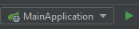

# TEST-amcef

This application at it's current state is not containerized, nor deployed anywhere. 
Therefore, as it is needs to be run from an IDE (or from cmd), this guide will be rather short (for now).

**Prerequisites**
- Java 17
- Maven 
- Some DB (MySQL, Oracle, etc.)

**How-to**
1. Create new table in your DB. Table can be found in: _Resources -> db -> create_table.sql_
2. Set the correct values for the datasource in application property
3. Open the project in your main IDE and run the application. 
You can find in the top bar something like this: 

4. Open your web browser and navigate to the url: [localhost:8080/api](localhost:8080/api)

There you will find the swagger page for all the endpoints. 

Disclaimer: This is a demo applications, some functionalities may be limited.
